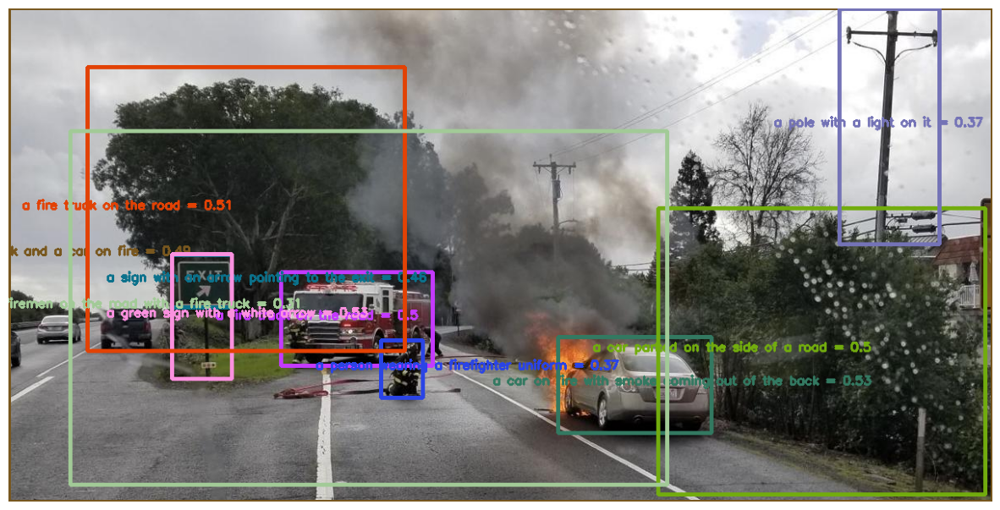
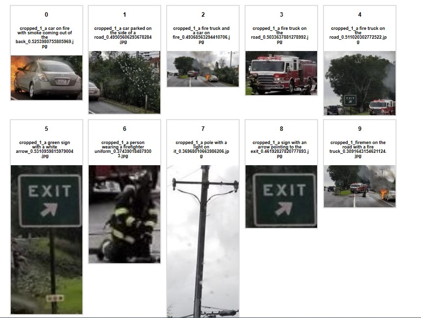

# Image Analysis V4.0 Captioning and Dense Captioning (public preview)

"Caption" replaces "Describe" in V4.0 as the significantly improved image captioning feature rich with details and sematic understanding. 

- Dense Captions provides more detail by generating one sentence descriptions of up to 10 regions of the image in addition to describing the whole image. 
- Dense Captions also returns bounding box coordinates of the described image regions. 
- There's also a new gender-neutral parameter to allow customers to choose whether to enable probabilistic gender inference for alt-text and Seeing AI applications. 
- Automatically deliver rich captions, accessible alt-text, SEO optimization, and intelligent photo curation to support digital content.

https://learn.microsoft.com/en-us/azure/cognitive-services/computer-vision/concept-describe-images-40?tabs=image

## Python demo notebook
<a href="https://github.com/retkowsky/dense_captions_Azure_Computer_Vision_4
.0/blob/main/Image%20retrieval%20(version%204.0%20preview)%20with%20Azure%20Computer%20Vision.ipynb">Python demo notebook</a>

## Results

## Dense captions from the image

13-Mar-2023 Serge Retkowsky | serge.retkowsky@microsoft.com | https://www.linkedin.com/in/serger/
